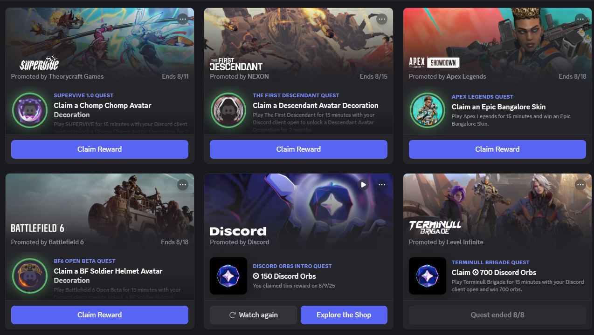

<h1 align="center">🎮 Discord Quest Completer 🚀</h1>

  
  

  <a href="README.md">🌐 View English README</a>

## 📝 بررسی اجمالی

این پروژه یک **اسکریپت جاوااسکریپت حرفه‌ای** است که برای **تکمیل خودکار کوئست‌های دیسکورد** پس از پذیرش دستی آن‌ها در نسخه‌ی دسکتاپ طراحی شده است.
اسکریپت از طریق **Developer Tools** به کلاینت دیسکورد تزریق می‌شود و با استفاده از APIهای داخلی، پیشرفت انواع کوئست (استریم، بازی، تماشای ویدیو و ...) را شبیه‌سازی می‌کند.

> ⚠️ **هشدار مهم:**
>
> * قبل از اجرای اسکریپت، **کوئست را به صورت دستی قبول کنید** (پذیرش خودکار دیگر پشتیبانی نمی‌شود).
> * استفاده از این اسکریپت می‌تواند منجر به **بن یا تعلیق حساب کاربری** شود.
> * صرفاً برای اهداف آموزشی ارائه شده است و نویسنده هیچ مسئولیتی ندارد.
> * برای کوئست‌های استریم حداقل یک حساب دیگر باید در کانال صوتی حضور داشته باشد و استریم را مشاهده کند.
> * پاداش‌ها باید **دستی** از مسیر `Settings > Gift Inventory` ادعا شوند تا از CAPTCHA جلوگیری شود.
> * اسکریپت روی اپ دسکتاپ ویندوز تست شده است؛ مرورگر و لینوکس محدودیت دارند.

## ✨ ویژگی‌ها

* ⚡ **تکمیل خودکار کوئست** (پس از پذیرش دستی):

  * 🎬 تماشای ویدیو (شبیه‌سازی پیشرفت)
  * 🕹️ بازی روی دسکتاپ (شبیه‌سازی تشخیص بازی)
  * 📡 استریم دسکتاپ (شبیه‌سازی پیشرفت؛ نیازمند حضور در VC)
  * 🧩 سایر فعالیت‌ها (قابل گسترش)
* 🛠️ **استفاده آسان** — فقط کپی و پیست در کنسول DevTools
* 🔧 **قابلیت توسعه** — افزودن کوئست‌های جدید به‌راحتی
* 🧾 **لاگ‌گیری دقیق** — نمایش پیشرفت و وضعیت در کنسول

## 🛡️ الزامات

* اپ دسکتاپ دیسکورد (Windows / macOS / Linux) — ترجیحاً ویندوز
* دسترسی به Developer Tools (پیش‌فرض فعال)
* پذیرش دستی کوئست پیش از اجرای اسکریپت
* آشنایی مقدماتی با کنسول DevTools
* در کوئست‌های استریم، حساب کاربری جانشین برای تماشای استریم

## 📥 نصب و استفاده

1. **باز کردن اپ دیسکورد دسکتاپ**
2. از مسیر **Discover → Quests** کوئست مورد نظر را به‌صورت دستی قبول کنید ✅
3. Developer Tools را باز کنید:

   * ویندوز/لینوکس: `Ctrl + Shift + I`
   * مک: `Cmd + Option + I`
4. به تب **Console** بروید 📟
5. محتوای فایل `quest_completer.js` را کپی و پیست کرده و **Enter** بزنید 🚀
6. لاگ‌های پیشرفت را در کنسول مشاهده کنید 👀
7. پس از اتمام، پاداش را به‌صورت دستی از **Settings → Gift Inventory** دریافت کنید 🎁

> 💡 **نکات مهم**:
>
> * اگر کوئستی نمایش داده نمی‌شود، تنظیمات منطقه یا حساب خود را بررسی کنید.
> * برای کوئست‌های استریم، از یک حساب جانشین برای تماشای استریم استفاده کنید.
> * در صورت بروز خطا، ممکن است اسکریپت نیاز به به‌روزرسانی داشته باشد.
> * برای عیب‌یابی پیشرفته می‌توانید از webpack modules در DevTools استفاده کنید.

## 🧰 مشکلات رایج و عیب‌یابی

| مشکل                  | راه‌حل پیشنهادی                                          |
| --------------------- | -------------------------------------------------------- |
| ❌ کوئست پیدا نشد      | ابتدا کوئست را **دستی قبول کنید**.                       |
| 🤖 CAPTCHA فعال شد    | ثبت‌نام یا تأیید را دستی انجام دهید.                     |
| ⚠️ خطاهای اسکریپت     | API داخلی تغییر کرده؛ نیاز به به‌روزرسانی اسکریپت دارید. |
| 🚫 کوئست کامل نمی‌شود | مطمئن شوید از نسخه دسکتاپ و شرایط مناسب استفاده می‌کنید. |
| 🐧 محدودیت روی لینوکس | ممکن است فعالیت‌ها تشخیص داده نشوند یا پاداش ثبت نشود.   |

## 🔄 قابلیت گسترش

* می‌توانید با ویرایش تابع `completeQuest` در `quest_completer.js`، کوئست‌های جدید اضافه کنید.
* از ماژول‌های داخلی دیسکورد مانند `api` و `FluxDispatcher` برای امکانات پیشرفته استفاده کنید.
* مشارکت آزاد است — فورک کنید و Pull Request بفرستید 🚀

## 📜 لایسنس

این پروژه تحت [MIT License](LICENSE) منتشر شده است.
استفاده، ویرایش و توزیع آن آزاد است.
⚠️ بدون هیچ‌گونه ضمانتی ارائه می‌شود

## 📬 ارتباط با من

**Matin Shahabadi (متین شاه‌آبادی / متین شاه آبادی)**

 وب‌سایت: [matinshahabadi.ir](https://matinshahabadi.ir)
* ایمیل: [me@matinshahabadi.ir](mailto:me@matinshahabadi.ir)
* گیت‌هاب: [power0matin](https://github.com/power0matin)
* لینکدین: [matin-shahabadi](https://www.linkedin.com/in/matin-shahabadi)

.

  © Created by <a href="https://github.com/power0matin">power0matin</a>

